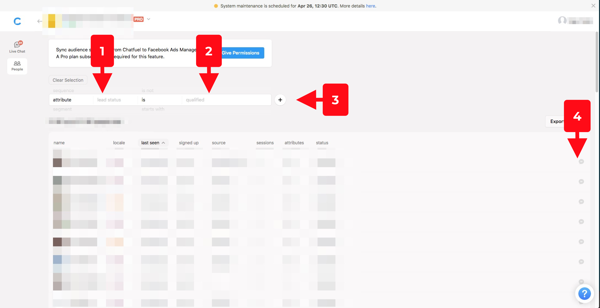

# Manual Chatfuel para Agentes
### ver 1.00
***

## Contenido <a id="content" />
* [Como accesar](#link2Chatfuel)
* [Estructura de Pantalla](#chatfuel)
* [Live Chat](#livechat)
    * [Active Chats](#activeLiveChat)
    * [Closed Chats](#closedLiveChat)
    * [All Chats](#allLiveChat)
* [People](#people)
    * [Como busco a un Usuario](#searchPeople)
* [Como apago a Mi Compa Bot 🤖](#exitBot)  

***

## Como Accesar 

Después de recibir tu invitación para usar chatfuel debes accesar con la siguiente liga [ChatFuel](https://dashboard.chatfuel.com/login)

Después presionar como lo señala la imagen.

[Regresar a Contenido](#content)

***

## Estructura de Pantalla 

1. **LiveChat**: En esta sección podemos ver las conversaciones que están siendo procesadas por el Mi Compa Bot  🤖.

2. **Closed**: Son las que cerramos al seleccionar que lo regresamos al bot.
3. **User**: Aquí podemos cerrar sesión.

4. **People**: Es donde podemos buscar usuarios.

5. **Active**: Son los chats que el usuario solicito un Asesor.

6. **All**: Son Todas las conversaciones que el Bot tuvo contacto.

[Regresar a Contenido](#content)
 
 ***
 
## LiveChat 
Sección donde se muestran los chats que procesa el chatbot

### Active Chats 

1. **Usuario Seleccionado**: Se mostrara el chat al darle click al nombre del Usuario.

2. **Atributos**: Se muestran los atributos que el chatbot almacena.

3. **No Vistos**: Son los usuarios que no hemos leído dentro del chatbot, al entrar a ver s conversación se marca como leído.

4. **Leave and Stop Live Chat**: Todo Chat que esta en sección hay que recordar que son chats que ya están fuero del Chatbot y en espera de un Agente los atienda, al presionar este botón lo regresamos con el bot.

5. **Quien Contesta**: Podemos seleccionar quien es el que regresa el mensaje, las opciones puede ser el Agente o el Bot.

[Regresar a Contenido](#content)

***

### Closed Chats 

1. **Usuario Seleccionado**: Se mostrara el chat al darle click al nombre del Usuario.

2. **Atributos**: Se muestran los atributos que el chatbot almacena.

3. **No Vistos**: Son los usuarios que no hemos leído dentro del chatbot, al entrar a ver s conversación se marca como leído.

4. **Send and Start Live Chat**: Con esta opción podemos apagar el bot y enviar al usuario una sesión Active donde el bot ya no participara.

5. **Quien Contesta**: Podemos seleccionar quien es el que regresa el mensaje, las opciones puede ser el Agente o el Bot.

[Regresar a Contenido](#content)

***

### All Chats 

1. **Usuario Seleccionado**: Se mostrara el chat al darle click al nombre del Usuario.

2. **Atributos**: Se muestran los atributos que el chatbot almacena.

3. **No Vistos**: Son los usuarios que no hemos leído dentro del chatbot, al entrar a ver s conversación se marca como leído.

4. **Send and Start Live Chat**: Con esta opción podemos apagar el bot y enviar al usuario una sesión Active donde el bot ya no participara.

5. **Quien Contesta**: Podemos seleccionar quien es el que regresa el mensaje, las opciones puede ser el Agente o el Bot.

[Regresar a Contenido](#content)

***

## People 
En esta sección se pueden hacer búsquedas de usuarios.

1. **Selección de atributo**: Podemos seleccionar sobre que atributo queremos buscar pero solo usaremos dos:
    * first name
    * last name

2. **Valor del atributo**: Pondremos lo que queremos buscar del atributo seleccionado.
    
3. **Agregar otra búsqueda**: Se agrega otro campo para buscar otro atributo.

4. **Mostrar LiveChat**: Nos lleva a mostrar el user buscado en Livechat para poder interactuar con el. 

[Regresar a Contenido](#content)

***

## Como busco a un Usuario 
Debes buscar por su "First Name", "Last Name" y después presionar al botón de enviar a livechat.
Es recomendado usar Ctrl Click o ⌘ Click  para que se abra otro Tab.

[Regresar a Contenido](#content)

***

## Como apago a Mi Compa Bot 

Al seleccionar al usuario y abrir el tab nos va enviar a esta pantalla

Como vimos anteriormente en el punto **4** nos va permitir sacarlo del Bot 🤖, solo hay que verificar que diga **Send a Start Live Chat** , si dice otra cosa significa que ya el bot esta desactivado 

[Regresar a Contenido](#content)

***